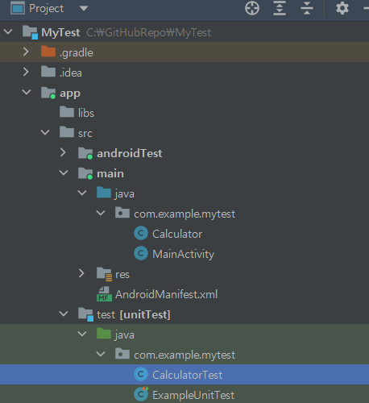

## How to Create a new repository on GitHub

1. Go to the GitHub website (github.com) and sign in to your account.
1. Click the plus sign (+) in the top-right corner of the screen, then select "New repository".
   
1. In the "Create a new repository" page, enter a name for your repository in the "Repository name" field.
1. Optionally, enter a description for your repository in the "Description" field.
   
1. Choose whether you want your repository to be public or private. Public repositories are visible to anyone, while private repositories can only be accessed by people you authorize.
1. If you want to include a README file with your repository, select the "Add a README file" option.
1. If you want to add a .gitignore file or license to your repository, you can do so by selecting the appropriate options.
1. Click the "Create repository" button to create your new repository.
   

That's it! You've now created a new repository on GitHub. You can use this repository to store your code, collaborate with others, and more.

## How to add into github of this codes?

To add your Android project with the example unit test that uses Mockito to GitHub, follow these steps:

1. [Create a new repository on GitHub.](#how-to-create-a-new-repository-on-github)
1. In Android Studio, go to VCS -> Import into Version Control -> Share Project on GitHub.
   
1. Enter your GitHub credentials and click "Log In".
   
1. Enter a Repository name and Description for your project.
1. Select a Privacy option for your repository (public or private).
1. Click "Clone"
   
1. Once the project is successfully shared, go to VCS -> Git -> Commit.
1. In the "Commit Changes" dialog, enter a commit message and select the files you want to commit.
1. Click "Commit and Push".
1. In the "Push Commits" dialog, select the branch you want to push and click "Push".
1. This will push your Android project with the example unit test that uses Mockito to the GitHub repository you created in step 1. You can now access your project on GitHub and make changes or collaborate with others as needed.

I hope this helps you get started with sharing your Android project on GitHub. If you have any questions or need further assistance, please let me know!

##  Could you help me create an Android project with an example unit test that uses Mockito 5.3.0 from build.gradle?

1. Open Android Studio and create a new project.
1. In the "Create New Project" dialog, select "Empty Activity" and click "Next".
1. Enter a project name, package name, and other details as required, and click "Finish".
1. In the build.gradle file (Module: app), add the following dependencies to the dependencies section:
``` javascript
dependencies {
    // ... other dependencies ...
    testImplementation 'org.mockito:mockito-core:5.3.0'
    testImplementation 'org.mockito:mockito-junit-jupiter:3.11.2'
    testImplementation 'org.junit.jupiter:junit-jupiter-api:5.7.2'
    testRuntimeOnly 'org.junit.jupiter:junit-jupiter-engine:5.7.2'
}
```
>This adds the JUnit and Mockito libraries to the project, which are required for writing and running unit tests. Note that we're using JUnit Jupiter (version 5.7.2) instead of the older JUnit 4.

5. In the "Project" pane, expand the "app" folder and right-click on the "java" folder.
1. Select "New" -> "Package" and create a new package called "com.example.mytest".
1. Right-click on the new package and select "New" -> "Java Class".

1. Name the class "Calculator" and click "OK". Add the following code to the class:
``` java
public class Calculator {
    public int add(int a, int b) {
        return a + b;
    }
}
```
>This creates a simple class with an "add" method that takes two integers and returns their sum.

9. Right-click on the "com.example.mytest" package and select "New" -> "Java Class".

1. Name the class "CalculatorTest" and click "OK". Add the following code to the class:
``` java
import org.junit.jupiter.api.Test;
import org.mockito.Mock;
import org.mockito.junit.jupiter.MockitoExtension;

import java.util.ArrayList;
import java.util.List;

import static org.junit.jupiter.api.Assertions.assertEquals;
import static org.mockito.Mockito.*;

@ExtendWith(MockitoExtension.class)
public class CalculatorTest {
    @Mock
    private Calculator calculator;

    @Test
    public void testAdd() {
        when(calculator.add(2, 3)).thenReturn(5);
        assertEquals(5, calculator.add(2, 3));
    }
}
```

>This creates a test class for the "Calculator" class that uses Mockito to test the "add" method. The test class uses the @Mock annotation to create a mock object of the "Calculator" class and the when method to specify the behavior of the "add" method when called with arguments (2, 3).

>Note that we're using the @ExtendWith(MockitoExtension.class) annotation to enable the Mockito extension for JUnit Jupiter.

11. Build and run the project to ensure that everything is working correctly.
1. I hope this helps you get started with unit testing in Android using Mockito 5.3.0. If you have any questions or need further assistance, please let me know!