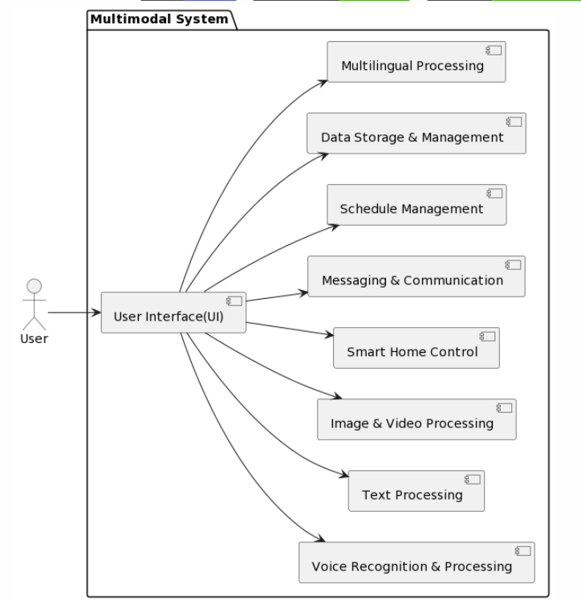

``` staruml
@startuml
left to right direction

actor User

package "Multimodal System" {
  [User Interface(UI)]
  [Voice Recognition & Processing]
  [Text Processing]
  [Image & Video Processing]
  [Smart Home Control]
  [Messaging & Communication]
  [Schedule Management]
  [Data Storage & Management]
  [Multilingual Processing]

  [User Interface(UI)] --> [Voice Recognition & Processing]
  [User Interface(UI)] --> [Text Processing]
  [User Interface(UI)] --> [Image & Video Processing]
  [User Interface(UI)] --> [Smart Home Control]
  [User Interface(UI)] --> [Messaging & Communication]
  [User Interface(UI)] --> [Schedule Management]
  [User Interface(UI)] --> [Data Storage & Management]
  [User Interface(UI)] --> [Multilingual Processing]
}

User --> [User Interface(UI)]

@enduml
```

