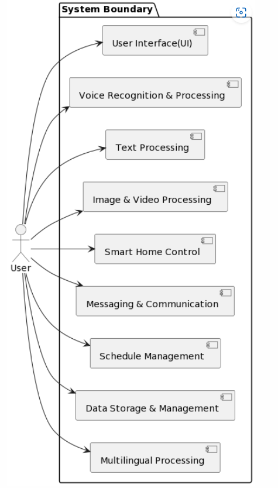

# 시스템 바운더리:
시스템은 외부 환경과 상호작용하는 다양한 인터페이스를 가지고 있습니다. 이러한 인터페이스에는 사용자 인터페이스, 스마트 홈 장치 인터페이스, 메시징 서비스 인터페이스, 일정 관리 서비스 인터페이스 등이 포함됩니다.

# 컴포넌트 뷰:

- 사용자 인터페이스(UI): 사용자가 음성, 텍스트, 이미지, 비디오 등 다양한 방식으로 시스템과 상호작용할 수 있는 인터페이스입니다.
- 음성 인식 및 처리 컴포넌트: 사용자의 음성을 텍스트로 변환하고, 텍스트를 처리하는 기능을 담당합니다.
- 텍스트 처리 컴포넌트: 사용자의 텍스트 입력을 처리하고, 적절한 응답을 생성하는 기능을 담당합니다.
- 이미지 및 비디오 처리 컴포넌트: 사용자의 이미지와 비디오 입력을 처리하는 기능을 담당합니다.
- 스마트 홈 제어 컴포넌트: 사용자의 명령에 따라 스마트 홈 장치를 제어하는 기능을 담당합니다.
- 메시징 및 커뮤니케이션 컴포넌트: 사용자의 메시지를 전송하고, 메시지 관련 알림을 처리하는 기능을 담당합니다.
- 일정 관리 컴포넌트: 사용자의 일정을 생성, 수정, 삭제하고, 일정 관련 알림을 처리하는 기능을 담당합니다.
- 데이터 저장 및 관리 컴포넌트: 사용자의 메모, 일정, 메시지 등 데이터를 저장하고 관리하는 기능을 담당합니다.
- 다국어 처리 컴포넌트: 다양한 언어를 처리하고, 사용자에게 적절한 언어로 응답을 생성하는 기능을 담당합니다.

이러한 컴포넌트들은 서로 상호작용하며, 각 use case를 처리합니다. 또한, 시스템은 외부 서비스와 통합되어 다양한 기능을 제공할 수 있습니다.

``` uml
@startuml
!define AWSPUML https://raw.githubusercontent.com/awslabs/aws-icons-for-plantuml/v14.0/Logos
!includeurl AWSPUML/AWSCommon.puml

actor User

package "System Boundary" {
  [User Interface(UI)]
  [Voice Recognition & Processing]
  [Text Processing]
  [Image & Video Processing]
  [Smart Home Control]
  [Messaging & Communication]
  [Schedule Management]
  [Data Storage & Management]
  [Multilingual Processing]
}

User --> [User Interface(UI)]
User --> [Voice Recognition & Processing]
User --> [Text Processing]
User --> [Image & Video Processing]
User --> [Smart Home Control]
User --> [Messaging & Communication]
User --> [Schedule Management]
User --> [Data Storage & Management]
User --> [Multilingual Processing]

@enduml
```




